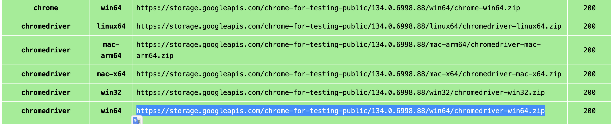

# AgenticSeek：私有、本地的 Manus 替代方案

<p align="center">

<p>

  English | [中文](./README_CHS.md) | [繁體中文](./README_CHT.md) | [Français](./README_FR.md) | [日本語](./README_JP.md) | [Português (Brasil)](./README_PTBR.md) | [Español](./README_ES.md) | [Türkçe](./README_TR.md)

*一个**100%本地运行的 Manus AI 替代品**，支持语音的 AI 助手，可自主浏览网页、编写代码、规划任务，所有数据仅保存在你的设备上。专为本地推理模型设计，完全在你的硬件上运行，确保隐私无忧，无需云端依赖。*

[](https://fosowl.github.io/agenticSeek.html)  [](https://discord.gg/8hGDaME3TC) [](https://x.com/Martin993886460) [](https://github.com/Fosowl/agenticSeek/stargazers)

### 为什么选择 AgenticSeek？

* 🔒 完全本地 & 私有 —— 所有内容都在你的电脑上运行，无云端、无数据共享。你的文件、对话和搜索都保持私密。

* 🌐 智能网页浏览 —— AgenticSeek 可自主浏览互联网：搜索、阅读、提取信息、填写网页表单，全程免手动。

* 💻 自动化编程助手 —— 需要代码？它能编写、调试并运行 Python、C、Go、Java 等程序，无需监督。

* 🧠 智能代理选择 —— 你提问，它自动判断最合适的代理来完成任务。就像有一支专家团队随时待命。

* 📋 规划并执行复杂任务 —— 从旅行规划到复杂项目，可将大任务拆分为步骤，调用多个 AI 代理协作完成。

* 🎙️ 语音支持 —— 干净、快速、未来感的语音与语音转文本功能，让你像科幻电影中的 AI 一样与它对话。（开发中）

### **演示**

> *你能搜索 agenticSeek 项目，了解需要哪些技能，然后打开 CV_candidates.zip 并告诉我哪些最匹配该项目吗？*

https://github.com/user-attachments/assets/b8ca60e9-7b3b-4533-840e-08f9ac426316

免责声明：本演示及出现的所有文件（如 CV_candidates.zip）均为虚构。我们不是公司，只寻求开源贡献者而非候选人。

> 🛠⚠️️ **项目正在积极开发中**

> 🙏 本项目起初只是一个副业，没有路线图也没有资金支持。它意外地登上了 GitHub Trending。非常感谢大家的贡献、反馈与耐心。

## 前置条件

开始前，请确保已安装以下软件：

*   **Git:** 用于克隆仓库。[下载 Git](https://git-scm.com/downloads)
*   **Python 3.10.x:** 强烈推荐使用 Python 3.10.x 版本。使用其他版本可能导致依赖错误。[下载 Python 3.10](https://www.python.org/downloads/release/python-3100/)（选择 3.10.x 版本）。
*   **Docker Engine & Docker Compose:** 用于运行捆绑服务如 SearxNG。
    *   安装 Docker Desktop（包含 Docker Compose V2）：[Windows](https://docs.docker.com/desktop/install/windows-install/) | [Mac](https://docs.docker.com/desktop/install/mac-install/) | [Linux](https://docs.docker.com/desktop/install/linux-install/)
    *   或者在 Linux 上分别安装 Docker Engine 和 Docker Compose：[Docker Engine](https://docs.docker.com/engine/install/) | [Docker Compose](https://docs.docker.com/compose/install/)（确保安装 Compose V2，例如 `sudo apt-get install docker-compose-plugin`）。

### 1. **克隆仓库并设置**

```sh
git clone https://github.com/Fosowl/agenticSeek.git
cd agenticSeek
mv .env.example .env
```

### 2. 修改 .env 文件内容

```sh
SEARXNG_BASE_URL="http://searxng:8080" # 如果在主机上运行 CLI 模式，使用 http://127.0.0.1:8080
REDIS_BASE_URL="redis://redis:6379/0"
WORK_DIR="/Users/mlg/Documents/workspace_for_ai"
OLLAMA_PORT="11434"
LM_STUDIO_PORT="1234"
CUSTOM_ADDITIONAL_LLM_PORT="11435"
OPENAI_API_KEY='optional'
DEEPSEEK_API_KEY='optional'
OPENROUTER_API_KEY='optional'
TOGETHER_API_KEY='optional'
GOOGLE_API_KEY='optional'
ANTHROPIC_API_KEY='optional'
```

根据需要更新 `.env` 文件：

- **SEARXNG_BASE_URL**: 除非在主机上运行 CLI 模式，否则保持不变。
- **REDIS_BASE_URL**: 保持不变 
- **WORK_DIR**: 本地工作目录路径。AgenticSeek 可读取和操作这些文件。
- **OLLAMA_PORT**: Ollama 服务端口号。
- **LM_STUDIO_PORT**: LM Studio 服务端口号。
- **CUSTOM_ADDITIONAL_LLM_PORT**: 任何额外自定义 LLM 服务的端口。

**API 密钥对于选择本地运行 LLM 的用户完全可选，这也是本项目的主要目的。如果硬件足够，请留空。**

### 3. **启动 Docker**

确保 Docker 已安装并在系统上运行。可以使用以下命令启动 Docker：

- **Linux/macOS:**  
    打开终端运行：
    ```sh
    sudo systemctl start docker
    ```
    或者如果已安装，从应用程序菜单启动 Docker Desktop。

- **Windows:**  
    从开始菜单启动 Docker Desktop。

可以通过执行以下命令验证 Docker 是否运行：
```sh
docker info
```
如果看到 Docker 安装信息，则表示运行正常。

请参阅下面的[本地提供商列表](#本地提供商列表)了解摘要。

下一步：[本地运行 AgenticSeek](#启动服务并运行)

*如果遇到问题，请参阅[故障排除](#故障排除)部分。*
*如果硬件无法本地运行 LLM，请参阅[使用 API 运行设置](#使用-api-运行设置)。*
*有关详细 `config.ini` 说明，请参阅[配置部分](#配置)。*

---

## 在您的机器上本地运行 LLM 的设置

**硬件要求：**

要本地运行 LLM，您需要足够的硬件。至少需要能够运行 Magistral、Qwen 或 Deepseek 14B 的 GPU。有关详细的模型/性能建议，请参阅 FAQ。

**设置您的本地提供商**  

启动您的本地提供商，例如使用 ollama：

```sh
ollama serve
```

请参阅下面的本地支持提供商列表。

**更新 config.ini**

更改 config.ini 文件，将 provider_name 设置为支持的提供商，provider_model 设置为您的提供商支持的 LLM。我们推荐推理模型，如 *Magistral* 或 *Deepseek*。

有关所需硬件，请参阅 README 末尾的 **FAQ**。

```sh
[MAIN]
is_local = True # 无论您是本地运行还是使用远程提供商。
provider_name = ollama # 或 lm-studio、openai 等。
provider_model = deepseek-r1:14b # 选择适合您硬件的模型
provider_server_address = 127.0.0.1:11434
agent_name = Jarvis # 您的 AI 名称
recover_last_session = True # 是否恢复上一个会话
save_session = True # 是否记住当前会话
speak = False # 文本转语音
listen = False # 语音转文本，仅限 CLI，实验性
jarvis_personality = False # 是否使用更"Jarvis"风格的性格（实验性）
languages = en zh # 语言列表，文本转语音将默认使用列表中的第一种语言
[BROWSER]
headless_browser = True # 除非在主机上使用 CLI，否则保持不变。
stealth_mode = True # 使用不可检测的 selenium 减少浏览器检测
```

**警告**：

- `config.ini` 文件格式不支持注释。
不要直接复制粘贴示例配置，因为注释会导致错误。相反，手动修改 `config.ini` 文件，使用您所需的设置，排除任何注释。

- 如果使用 LM-studio 运行 LLM，请*不要*将 provider_name 设置为 `openai`。将其设置为 `lm-studio`。

- 某些提供商（例如：lm-studio）要求您在 IP 前加上 `http://`。例如 `http://127.0.0.1:1234`

**本地提供商列表**

| 提供商  | 本地？ | 描述                                               |
|-----------|--------|-----------------------------------------------------------|
| ollama    | 是    | 使用 ollama 作为 LLM 提供商轻松本地运行 LLM |
| lm-studio  | 是    | 使用 LM studio 本地运行 LLM（将 `provider_name` 设置为 `lm-studio`）|
| openai    | 是     |  使用 openai 兼容 API（例如：llama.cpp 服务器）  |

下一步：[启动服务并运行 AgenticSeek](#启动服务并运行)  

*如果遇到问题，请参阅[故障排除](#故障排除)部分。*
*如果硬件无法本地运行 LLM，请参阅[使用 API 运行设置](#使用-api-运行设置)。*
*有关详细 `config.ini` 说明，请参阅[配置部分](#配置)。*

## 使用 API 运行设置

此设置使用外部、基于云的 LLM 提供商。您需要从所选服务获取 API 密钥。

**1. 选择 API 提供商并获取 API 密钥：**

请参阅下面的[API 提供商列表](#api-提供商列表)。访问他们的网站注册并获取 API 密钥。

**2. 将您的 API 密钥设置为环境变量：**

*   **Linux/macOS:**
    打开终端并使用 `export` 命令。最好将其添加到 shell 的配置文件中（例如 `~/.bashrc`、`~/.zshrc`）以保持持久性。
    ```sh
    export PROVIDER_API_KEY="your_api_key_here" 
    # 将 PROVIDER_API_KEY 替换为特定的变量名，例如 OPENAI_API_KEY、GOOGLE_API_KEY
    ```
    TogetherAI 示例：
    ```sh
    export TOGETHER_API_KEY="xxxxxxxxxxxxxxxxxxxxxx"
    ```
*   **Windows:**
    *   **命令提示符（当前会话临时）：**
        ```cmd
        set PROVIDER_API_KEY=your_api_key_here
        ```
    *   **PowerShell（当前会话临时）：**
        ```powershell
        $env:PROVIDER_API_KEY="your_api_key_here"
        ```
    *   **永久性：** 在 Windows 搜索栏中搜索"环境变量"，点击"编辑系统环境变量"，然后点击"环境变量..."按钮。添加一个新的用户变量，使用适当的名称（例如 `OPENAI_API_KEY`）和您的密钥作为值。

    *(有关更多详细信息，请参阅 FAQ：[如何设置 API 密钥？](#如何设置-api-密钥))。*


**3. 更新 `config.ini`：**
```ini
[MAIN]
is_local = False
provider_name = openai # 或 google、deepseek、togetherAI、huggingface
provider_model = gpt-3.5-turbo # 或 gemini-1.5-flash、deepseek-chat、mistralai/Mixtral-8x7B-Instruct-v0.1 等。
provider_server_address = # 当 is_local = False 时，对于大多数 API 通常被忽略或可以留空
# ... 其他设置 ...
```
*警告：* 确保 `config.ini` 值中没有尾随空格。

**API 提供商列表**

| 提供商     | `provider_name` | 本地？ | 描述                                       | API 密钥链接（示例）                     |
|--------------|-----------------|--------|---------------------------------------------------|---------------------------------------------|
| OpenAI       | `openai`        | 否     | 通过 OpenAI 的 API 使用 ChatGPT 模型。              | [platform.openai.com/signup](https://platform.openai.com/signup) |
| Google Gemini| `google`        | 否     | 通过 Google AI Studio 使用 Google Gemini 模型。    | [aistudio.google.com/keys](https://aistudio.google.com/keys) |
| Deepseek     | `deepseek`      | 否     | 通过他们的 API 使用 Deepseek 模型。                | [platform.deepseek.com](https://platform.deepseek.com) |
| Hugging Face | `huggingface`   | 否     | 使用 Hugging Face Inference API 中的模型。       | [huggingface.co/settings/tokens](https://huggingface.co/settings/tokens) |
| TogetherAI   | `togetherAI`    | 否     | 通过 TogetherAI API 使用各种开源模型。| [api.together.ai/settings/api-keys](https://api.together.ai/settings/api-keys) |
| OpenRouter   | `openrouter`    | No     | 通过 OpenRouter 使用各种开源模型| [https://openrouter.ai/](https://openrouter.ai/) |
| MiniMax      | `minimax`       | 否     | 使用 MiniMax 模型（如 MiniMax-M2.7、MiniMax-M2.5）。 | [platform.minimax.io](https://platform.minimax.io/user-center/basic-information) |

*注意：*
*   我们不建议将 `gpt-4o` 或其他 OpenAI 模型用于复杂的网页浏览和任务规划，因为当前的提示优化针对 Deepseek 等模型。
*   编码/bash 任务可能会遇到 Gemini 的问题，因为它可能不严格遵循针对 Deepseek 优化的格式化提示。
*   当 `is_local = False` 时，`config.ini` 中的 `provider_server_address` 通常不使用，因为 API 端点通常在相应提供商的库中硬编码。

下一步：[启动服务并运行 AgenticSeek](#启动服务并运行)

*如果遇到问题，请参阅**已知问题**部分*

*有关详细配置文件说明，请参阅**配置**部分。*

---

## 启动服务并运行

默认情况下，AgenticSeek 完全在 Docker 中运行。

**选项 1:** 在 Docker 中运行，使用 Web 界面：

启动所需服务。这将启动 docker-compose.yml 中的所有服务，包括：
    - searxng
    - redis（searxng 所需）
    - frontend
    - backend（如果使用 Web 界面时使用 `full`）

```sh
./start_services.sh full # MacOS
start start_services.cmd full # Windows
```

**警告：** 此步骤将下载并加载所有 Docker 镜像，可能需要长达 30 分钟。启动服务后，请等待后端服务完全运行（您应该在日志中看到 **backend: "GET /health HTTP/1.1" 200 OK**）后再发送任何消息。首次运行时，后端服务可能需要 5 分钟才能启动。

转到 `http://localhost:3000/`，您应该会看到 Web 界面。

*服务启动故障排除：* 如果这些脚本失败，请确保 Docker Engine 正在运行并且 Docker Compose（V2，`docker compose`）已正确安装。检查终端输出中的错误消息。请参阅 [FAQ：帮助！运行 AgenticSeek 或其脚本时出现错误。](#faq-故障排除)

**选项 2:** CLI 模式：

要使用 CLI 界面运行，您必须在主机上安装软件包：

```sh
./install.sh
./install.bat # windows
```

然后您必须将 `config.ini` 中的 SEARXNG_BASE_URL 更改为：

```sh
SEARXNG_BASE_URL="http://localhost:8080"
```

启动所需服务。这将启动 docker-compose.yml 中的一些服务，包括：
    - searxng
    - redis（searxng 所需）
    - frontend

```sh
./start_services.sh # MacOS
start start_services.cmd # Windows
```

运行：uv run: `uv run python -m ensurepip` 以确保 uv 已启用 pip。

使用 CLI：`uv run cli.py`

---

## 使用方法

确保服务已通过 `./start_services.sh full` 启动并运行，然后转到 `localhost:3000` 使用 Web 界面。

您也可以通过设置 `listen = True` 来使用语音转文本。仅限 CLI 模式。

要退出，只需说/输入 `goodbye`。

以下是一些使用示例：

> *用 python 写一个贪吃蛇游戏！*

> *搜索法国雷恩的最佳咖啡馆，并将三家及其地址保存到 rennes_cafes.txt。*

> *写一个 Go 程序计算阶乘，保存为 factorial.go 到你的工作区*

> *在 summer_pictures 文件夹中查找所有 JPG 文件，用今天日期重命名，并将重命名文件列表保存到 photos_list.txt*

> *在线搜索 2024 年热门科幻电影，挑选三部今晚观看，保存到 movie_night.txt。*

> *搜索 2025 年最新 AI 新闻文章，选三篇，写 Python 脚本抓取标题和摘要，脚本保存为 news_scraper.py，摘要保存到 ai_news.txt（/home/projects）*

> *周五，搜索免费股票价格 API，用 supersuper7434567@gmail.com 注册，然后写 Python 脚本每日获取特斯拉股价，结果保存到 stock_prices.csv*

*请注意，表单填写功能仍为实验性，可能失败。*

输入查询后，AgenticSeek 将分配最佳代理执行任务。

由于这是早期原型，代理路由系统可能无法总是根据您的查询分配正确的代理。

因此，您应该非常明确地表达您想要什么以及 AI 可能如何进行，例如如果您希望它进行网页搜索，不要说：

`你知道哪些适合独自旅行的国家吗？`

而应说：

`进行网页搜索，找出最适合独自旅行的国家`

---

## **在自己的服务器上运行 LLM 的设置**  

如果您有功能强大的计算机或可以使用的服务器，但想从笔记本电脑使用它，您可以选择使用我们的自定义 llm 服务器在远程服务器上运行 LLM。

在将运行 AI 模型的"服务器"上，获取 IP 地址

```sh
ip a | grep "inet " | grep -v 127.0.0.1 | awk '{print $2}' | cut -d/ -f1 # 本地 IP
curl https://ipinfo.io/ip # 公共 IP
```

注意：对于 Windows 或 macOS，分别使用 ipconfig 或 ifconfig 查找 IP 地址。

克隆仓库并进入 `server/` 文件夹。

```sh
git clone --depth 1 https://github.com/Fosowl/agenticSeek.git
cd agenticSeek/llm_server/
```

安装服务器特定要求：

```sh
pip3 install -r requirements.txt
```

运行服务器脚本。

```sh
python3 app.py --provider ollama --port 3333
```

您可以选择使用 `ollama` 和 `llamacpp` 作为 LLM 服务。

现在在您的个人计算机上：

更改 `config.ini` 文件，将 `provider_name` 设置为 `server`，`provider_model` 设置为 `deepseek-r1:xxb`。
将 `provider_server_address` 设置为将运行模型的机器的 IP 地址。

```sh
[MAIN]
is_local = False
provider_name = server
provider_model = deepseek-r1:70b
provider_server_address = http://x.x.x.x:3333
```

下一步：[启动服务并运行 AgenticSeek](#启动服务并运行)  

---

## 语音转文本

警告：目前语音转文本仅适用于 CLI 模式。

请注意，目前语音转文本仅适用于英语。

语音转文本功能默认禁用。要启用它，请在 config.ini 文件中将 listen 选项设置为 True：

```
listen = True
```

启用后，语音转文本功能会监听触发关键字，即代理的名称，然后开始处理您的输入。您可以通过更新 *config.ini* 文件中的 `agent_name` 值来自定义代理的名称：

```
agent_name = Friday
```

为了获得最佳识别效果，我们建议使用常见的英文名称，如 "John" 或 "Emma" 作为代理名称。

一旦您看到转录开始出现，请大声说出代理的名称以唤醒它（例如，"Friday"）。

清晰地说出您的查询。

用确认短语结束您的请求，以指示系统继续。确认短语的示例包括：
```
"do it", "go ahead", "execute", "run", "start", "thanks", "would ya", "please", "okay?", "proceed", "continue", "go on", "do that", "go it", "do you understand?"
```

## 配置

配置示例：
```
[MAIN]
is_local = True
provider_name = ollama
provider_model = deepseek-r1:32b
provider_server_address = http://127.0.0.1:11434 # Ollama 示例；LM-Studio 使用 http://127.0.0.1:1234
agent_name = Friday
recover_last_session = False
save_session = False
speak = False
listen = False

jarvis_personality = False
languages = en zh # TTS 和潜在路由的语言列表。
[BROWSER]
headless_browser = False
stealth_mode = False
```

**`config.ini` 设置说明**：

*   **`[MAIN]` 部分：**
    *   `is_local`: 如果使用本地 LLM 提供商（Ollama、LM-Studio、本地 OpenAI 兼容服务器）或自托管服务器选项，则为 `True`。如果使用基于云的 API（OpenAI、Google 等），则为 `False`。
    *   `provider_name`: 指定 LLM 提供商。
        *   本地选项：`ollama`、`lm-studio`、`openai`（用于本地 OpenAI 兼容服务器）、`server`（用于自托管服务器设置）。
        *   API 选项：`openai`、`google`、`deepseek`、`huggingface`、`togetherAI`。
    *   `provider_model`: 所选提供商的特定模型名称或 ID（例如，Ollama 的 `deepseekcoder:6.7b`，OpenAI API 的 `gpt-3.5-turbo`，TogetherAI 的 `mistralai/Mixtral-8x7B-Instruct-v0.1`）。
    *   `provider_server_address`: 您的 LLM 提供商的地址。
        *   对于本地提供商：例如，Ollama 的 `http://127.0.0.1:11434`，LM-Studio 的 `http://127.0.0.1:1234`。
        *   对于 `server` 提供商类型：您的自托管 LLM 服务器的地址（例如 `http://your_server_ip:3333`）。
        *   对于云 API（`is_local = False`）：这通常被忽略或可以留空，因为 API 端点通常由客户端库处理。
    *   `agent_name`: AI 助手的名称（例如 Friday）。如果启用，用作语音转文本的触发词。
    *   `recover_last_session`: `True` 尝试恢复上一个会话的状态，`False` 重新开始。
    *   `save_session`: `True` 保存当前会话的状态以供潜在恢复，`False` 否则。
    *   `speak`: `True` 启用文本转语音语音输出，`False` 禁用。
    *   `listen`: `True` 启用语音转文本语音输入（仅限 CLI 模式），`False` 禁用。
    *   `work_dir`: **关键：** AgenticSeek 将读取/写入文件的目录。**确保此路径在您的系统上有效且可访问。**
    *   `jarvis_personality`: `True` 使用更"Jarvis-like"的系统提示（实验性），`False` 使用标准提示。
    *   `languages`: 逗号分隔的语言列表（例如 `en, zh, fr`）。用于 TTS 语音选择（默认为第一个），并可以协助 LLM 路由器。为避免路由器效率低下，避免使用过多或非常相似的语言。
*   **`[BROWSER]` 部分：**
    *   `headless_browser`: `True` 在没有可见窗口的情况下运行自动化浏览器（推荐用于 Web 界面或非交互式使用）。`False` 显示浏览器窗口（对于 CLI 模式或调试有用）。
    *   `stealth_mode`: `True` 启用使浏览器自动化更难检测的措施。可能需要手动安装浏览器扩展，如 anticaptcha。

本节总结了支持的 LLM 提供商类型。在 `config.ini` 中配置它们。

**本地提供商（在您自己的硬件上运行）：**

| config.ini 中的提供商名称 | `is_local` | 描述                                                                 | 设置部分                                                    |
|-------------------------------|------------|-----------------------------------------------------------------------------|------------------------------------------------------------------|
| `ollama`                      | `True`     | 使用 Ollama 轻松提供本地 LLM。                                             | [在您的机器上本地运行 LLM 的设置](#在您的机器上本地运行-llm-的设置) |
| `lm-studio`                   | `True`     | 使用 LM-Studio 提供本地 LLM。                                          | [在您的机器上本地运行 LLM 的设置](#在您的机器上本地运行-llm-的设置) |
| `openai`（用于本地服务器）   | `True`     | 连接到暴露 OpenAI 兼容 API 的本地服务器（例如，llama.cpp）。 | [在您的机器上本地运行 LLM 的设置](#在您的机器上本地运行-llm-的设置) |
| `server`                      | `False`    | 连接到在另一台机器上运行的 AgenticSeek 自托管 LLM 服务器。 | [在自己的服务器上运行 LLM 的设置](#在自己的服务器上运行-llm-的设置) |

**API 提供商（基于云）：**

| config.ini 中的提供商名称 | `is_local` | 描述                                      | 设置部分                                       |
|-------------------------------|------------|--------------------------------------------------|-----------------------------------------------------|
| `openai`                      | `False`    | 使用 OpenAI 的官方 API（例如，GPT-3.5、GPT-4）。 | [使用 API 运行设置](#使用-api-运行设置) |
| `google`                      | `False`    | 通过 API 使用 Google 的 Gemini 模型。              | [使用 API 运行设置](#使用-api-运行设置) |
| `deepseek`                    | `False`    | 使用 Deepseek 的官方 API。                     | [使用 API 运行设置](#使用-api-运行设置) |
| `huggingface`                 | `False`    | 使用 Hugging Face Inference API。                  | [使用 API 运行设置](#使用-api-运行设置) |
| `togetherAI`                  | `False`    | 使用 TogetherAI 的 API 获取各种开放模型。    | [使用 API 运行设置](#使用-api-运行设置) |

---
## 故障排除

如果遇到问题，本节提供指导。

# 已知问题

## ChromeDriver 问题

**错误示例：** `SessionNotCreatedException: Message: session not created: This version of ChromeDriver only supports Chrome version XXX`

### 根本原因
ChromeDriver 版本不兼容发生在：
1. 您安装的 ChromeDriver 版本与 Chrome 浏览器版本不匹配
2. 在 Docker 环境中，`undetected_chromedriver` 可能会下载自己的 ChromeDriver 版本，绕过挂载的二进制文件

### 解决步骤

#### 1. 检查您的 Chrome 版本
打开 Google Chrome → `设置 > 关于 Chrome` 查找您的版本（例如，"版本 134.0.6998.88"）

#### 2. 下载匹配的 ChromeDriver

**对于 Chrome 115 及更新版本：** 使用 [Chrome for Testing API](https://googlechromelabs.github.io/chrome-for-testing/)
- 访问 Chrome for Testing 可用性仪表板
- 找到您的 Chrome 版本或最接近的可用匹配
- 为您的操作系统下载 ChromeDriver（Docker 环境使用 Linux64）

**对于旧版 Chrome：** 使用 [旧版 ChromeDriver 下载](https://chromedriver.chromium.org/downloads)



#### 3. 安装 ChromeDriver（选择一种方法）

**方法 A：项目根目录（Docker 推荐）**
```bash
# 将下载的 chromedriver 二进制文件放在项目根目录
cp path/to/downloaded/chromedriver ./chromedriver
chmod +x ./chromedriver  # 在 Linux/macOS 上使其可执行
```

**方法 B：系统 PATH**
```bash
# Linux/macOS
sudo mv chromedriver /usr/local/bin/
sudo chmod +x /usr/local/bin/chromedriver

# Windows：将 chromedriver.exe 放在 PATH 中的文件夹中
```

#### 4. 验证安装
```bash
# 测试 ChromeDriver 版本
./chromedriver --version
# 或者在 PATH 中：
chromedriver --version
```

### Docker 特定说明

⚠️ **Docker 用户重要：**
- Docker 卷挂载方法可能不适用于隐身模式（`undetected_chromedriver`）
- **解决方案：** 将 ChromeDriver 放在项目根目录中作为 `./chromedriver`
- 应用程序将自动检测并使用此二进制文件
- 您应该在日志中看到：`"Using ChromeDriver from project root: ./chromedriver"`

### 故障排除提示

1. **仍然遇到版本不匹配？**
   - 验证 ChromeDriver 是否可执行：`ls -la ./chromedriver`
   - 检查 ChromeDriver 版本：`./chromedriver --version`
   - 确保它与您的 Chrome 浏览器版本匹配

2. **Docker 容器问题？**
   - 检查后端日志：`docker logs backend`
   - 查找消息：`"Using ChromeDriver from project root"`
   - 如果未找到，请验证文件是否存在且可执行

3. **Chrome for Testing 版本**
   - 尽可能使用完全匹配的版本
   - 对于版本 134.0.6998.88，使用 ChromeDriver 134.0.6998.165（最接近的可用版本）
   - 主要版本号必须匹配（134 = 134）

### 版本兼容性矩阵

| Chrome 版本 | ChromeDriver 版本 | 状态 |
|----------------|---------------------|---------|
| 134.0.6998.x   | 134.0.6998.165     | ✅ 可用 |
| 133.0.6943.x   | 133.0.6943.141     | ✅ 可用 |
| 132.0.6834.x   | 132.0.6834.159     | ✅ 可用 |

*有关最新兼容性，请查看 [Chrome for Testing 仪表板](https://googlechromelabs.github.io/chrome-for-testing/)*

`Exception: Failed to initialize browser: Message: session not created: This version of ChromeDriver only supports Chrome version 113
Current browser version is 134.0.6998.89 with binary path`

如果您的浏览器和 chromedriver 版本不匹配，会发生这种情况。

您需要导航到下载最新版本：

https://developer.chrome.com/docs/chromedriver/downloads

如果您使用 Chrome 版本 115 或更新版本，请转到：

https://googlechromelabs.github.io/chrome-for-testing/

并下载与您的操作系统匹配的 chromedriver 版本。


如果此部分不完整，请提出问题。

##  连接适配器问题

```
Exception: Provider lm-studio failed: HTTP request failed: No connection adapters were found for '127.0.0.1:1234/v1/chat/completions'`（注意：端口可能不同）
```

*   **原因：** `config.ini` 中 `lm-studio`（或其他类似的本地 OpenAI 兼容服务器）的 `provider_server_address` 缺少 `http://` 前缀或指向错误的端口。
*   **解决方案：**
    *   确保地址包含 `http://`。LM-Studio 通常默认为 `http://127.0.0.1:1234`。
    *   正确的 `config.ini`：`provider_server_address = http://127.0.0.1:1234`（或您的实际 LM-Studio 服务器端口）。

## SearxNG 基本 URL 未提供

```
raise ValueError("SearxNG base URL must be provided either as an argument or via the SEARXNG_BASE_URL environment variable.")
ValueError: SearxNG base URL must be provided either as an argument or via the SEARXNG_BASE_URL environment variable.`
```

如果您使用错误的 searxng 基本 URL 运行 CLI 模式，可能会出现这种情况。

SEARXNG_BASE_URL 应根据您是在 Docker 中运行还是在主机上运行而有所不同：

**在主机上运行**：`SEARXNG_BASE_URL="http://localhost:8080"`

**完全在 Docker 中运行（Web 界面）**：`SEARXNG_BASE_URL="http://searxng:8080"`

## FAQ

**问：我需要什么硬件？**  

| 模型大小  | GPU  | 评论                                               |
|-----------|--------|-----------------------------------------------------------|
| 7B        | 8GB 显存 | ⚠️ 不推荐。性能差，频繁出现幻觉，规划代理可能会失败。 |
| 14B        | 12 GB VRAM（例如 RTX 3060） | ✅ 可用于简单任务。可能在网页浏览和规划任务方面有困难。 |
| 32B        | 24+ GB VRAM（例如 RTX 4090） | 🚀 大多数任务成功，可能仍然在任务规划方面有困难 |
| 70B+        | 48+ GB 显存 | 💪 优秀。推荐用于高级用例。 |

**问：我遇到错误该怎么办？**  

确保本地正在运行（`ollama serve`），您的 `config.ini` 与您的提供商匹配，并且依赖项已安装。如果都不起作用，请随时提出问题。

**问：它真的可以 100% 本地运行吗？**  

是的，使用 Ollama、lm-studio 或服务器提供商，所有语音转文本、LLM 和文本转语音模型都在本地运行。非本地选项（OpenAI 或其他 API）是可选的。

**问：当我有 Manus 时，为什么应该使用 AgenticSeek？**

与 Manus 不同，AgenticSeek 优先考虑独立于外部系统，给您更多控制、隐私和避免 API 成本。

**问：谁是这个项目的幕后推手？**

这个项目是由我创建的，还有两个朋友作为维护者和 GitHub 上开源社区的贡献者。我们只是一群充满热情的个人，不是初创公司，也不隶属于任何组织。

X 上除了我的个人账户（https://x.com/Martin993886460）之外的任何 AgenticSeek 账户都是冒充的。

## 贡献

我们正在寻找开发人员来改进 AgenticSeek！查看开放的问题或讨论。

[贡献指南](./docs/CONTRIBUTING.md)

## 赞助商：

想要通过航班搜索、旅行规划或抢购最佳购物优惠等功能来提升 AgenticSeek 的能力？考虑使用 SerpApi 制作自定义工具，以解锁更多 Jarvis 般的功能。使用 SerpApi，您可以为专业任务加速您的代理，同时保持完全控制。

<a href="https://serpapi.com/"></a>

查看 [Contributing.md](./docs/CONTRIBUTING.md) 了解如何集成自定义工具！

### **赞助商**：

- [tatra-labs](https://github.com/tatra-labs)

## 维护者：

 > [Fosowl](https://github.com/Fosowl) | 巴黎时间 

 > [antoineVIVIES](https://github.com/antoineVIVIES) | 台北时间 

## 特别感谢：

 > [tcsenpai](https://github.com/tcsenpai) 和 [plitc](https://github.com/plitc) 协助后端 Docker 化

[](https://www.star-history.com/#Fosowl/agenticSeek&Date)
